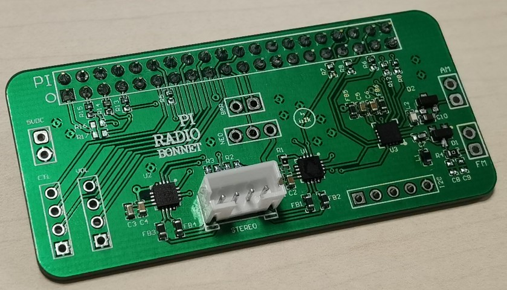
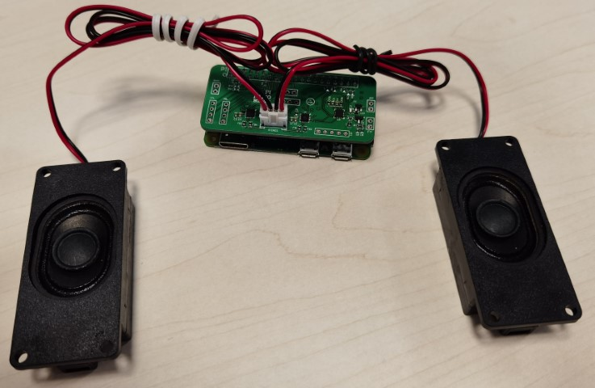
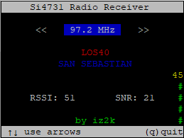

# pi-radio-SI4731
Si473x i2c/i2s AM/FM radio receiver for Rasperrby Pi

## Hardware

A custom Pi Radio Bonnet is included in this project. The PCB features the SI4731-D60-GM IC, an AM/FM Broadcast Radio Receiver with RDS/RBDS. The reference clock is provided from the Pi through a hardware clock capable GPIO, and the I2C interface is used to control the functionality.

Besides the radio receiver, the PCB also features two units of the MAX98357A 3W PCM Amplifier, providing high quality stereo output.

The I2S audio interface is used for all devices, where the Pi acts as the master device reading digital audio from the radio receiver through the I2S_DIN line, and providing digital audio data to the amplifiers through the I2S_DOUT line. 




## Raspberry Pi setup

In order to use the Pi Radio Bonnet, you will need to enable I2S audio, I2C control and install some software pedendencies for the radio controller software to work. You can do it the easy way executing the following script:

``` bash
wget xxxx | bash
```

Or you can do it the hard way following this instructions:

### Enable I2S

``` bash
sudo nano /boot/config.txt
 -> dtparam=i2s=on 		# uncomment or add
 -> dtoverlay=i2s-mmap 	# uncomment or add
```

### Enable I2S soundcard

For simplicity, we will use the already available soundcard driver from GoogleVoiceHat. This souncard includes both, I2S stereo output DAC and I2S stereo input microphone and the driver works flawlessly. The driver is already compiled and included in Raspberry Pi OS (AKA Raspian). All we have to do is enable it adding a Device Tree Overlay.

``` bash
sudo nano /boot/config.txt
 -> dtoverlay=googlevoicehat-soundcard 		# uncomment or add
```

### Add ALSA configuration

In order to improve the integration of the new sound-card in the OS let's add an ALSA configuration file.
``` bash
sudo nano /etc/asound.conf
```

And paste the following into it:
```
pcm.speaker {
	type softvol
	slave.pcm dmix
	control {
		name Master
		card 0
	}
}

pcm.mic {
	type route
	slave.pcm dsnoop
	ttable {
		0.0 1
		1.1 1
	}
}

pcm.!default {
	type asym
	playback.pcm "plug:speaker"
	capture.pcm "plug:mic"
}

ctl.!default {
	type hw
	card 0
}
```
With this configuration software volume control and a mixer for shared audio playbacks is added to the playback device, and a dsnoop configuration is added to the capture device so that it can also be shared amongst multiple applications.

## Control software

In order to initialize the radio receiver, the REFCLK clock has to be enabled and a reset pulse has to be sent. Next, the I2C bus can be used to send commands to the device, set volume, band, frequency and alike.

A python program is included in the project to do all of this for you. Before running the program, some dependencies have to be installed.

### Enable I2C

First, enable the I2C hardware on the Pi:

``` bash
sudo raspi-config nonint do_i2c 0
```
### PIP3

Ensure pip3 is available to install python3 packages:
``` bash
sudo apt-get install python3-pip
```


### PIGPIO

The control of the GPIOs for REFCLK and RST and SEN signals is done by means of the pigpio daemon. This is a low level GPIO controller that can be commanded through other programs like the python program used in this project.

Install the daemon running the following commands:
``` bash
sudo apt-get install pigpio
```
Next, modify the systemd init script to specify pigpiod to work with PWM clock peripheral. By default it works with PCM, which we want to use for I2S instead.

Edit the following file and replace -l with -t 0 in the ExecStart line.
``` bash
sudo nano /lib/systemd/system/pigpiod.service
```

Now, enable autostart for pigpiod:
``` bash
sudo systemctl enable pigpiod.service
sudo systemctl start pigpiod.service
```

Finally, install the python3 package to control the pigpio daemon from the program.

``` bash
sudo apt-get install python3-pigpio
```
or
``` bash
sudo pip3 install pigpio
```

### SMBUS2

The python program uses the SMBUS2 package for the I2C communication. Install it as follows:

``` bash
sudo pip3 install smbus
```

### ALSAAUDIO

The python program uses the ALSAAUDIO package to control the volume of the soundcard. Install it as follows:

``` bash
sudo apt-get install python3-alsaaudio
```

## Usage

In order to tune the radio receiver, execute the python program.

``` bash
python3 sw/python/main.py
```

The python software allows seeking radio stations by using left and right arrows. The up and down arrows allow changing the volume in the mixer. The PS field (Radio Station) and RadioText field of the RDS signal, if available, is also shown under the tuned frequency.

